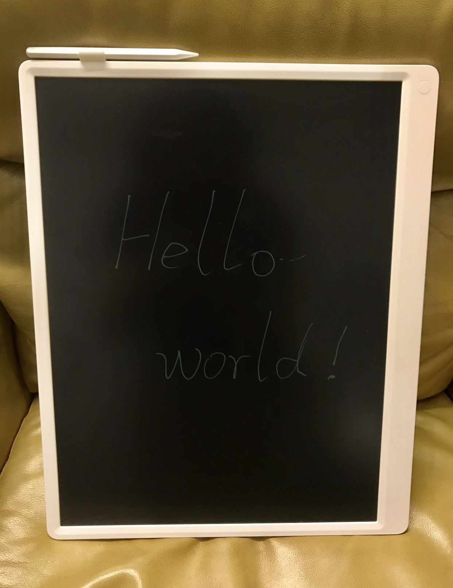

# Write down something.

And here's my new partner - [Xiaomi's LCD writing tablet](1)!

You can practice writing [Hiragana](2) or [POC](3) the critical step of any algorithm.

Anyways, it's an very funny gadget.

# Thanks list ❤️
- [CyC2018/CS-notes](4)
- [龍樹中觀的世界: The World of Mulamadhyamakakarika (Traditional Chinese Edition)](5)
- [AlgoCasts 用心做好每一个算法视频](6)

# Todos
- rewrite to Python version
- rewrite to JavaScript version

[1]: <https://www.amazon.com/Original-Writing-Electronic-Graphic-Drawing/dp/B08RCLW6TT/> "Xiaomi's LCD writing tablet"
[2]: <https://en.wikipedia.org/wiki/Hiragana> "Hiragana"
[3]: <https://en.wikipedia.org/wiki/Proof_of_concept> "Proof_of_concept"
[4]: <https://github.com/CyC2018/CS-Notes> "CS-Notes"
[5]: <https://www.amazon.com/%E9%BE%8D%E6%A8%B9%E4%B8%AD%E8%A7%80%E7%9A%84%E4%B8%96%E7%95%8C-World-Mulamadhyamakakarika-Traditional-Chinese-ebook/dp/B08MTGLJBR/> "龍樹中觀的世界"
[6]: <https://algocasts.io/> "algocasts"
